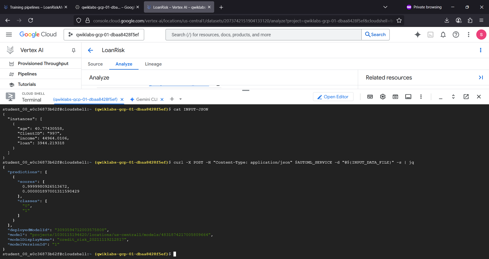

# loanriskaml 💸🦹
loanriskaml : Predict Loan Risk # AutoML # Tabular Classification Model

## Objective
- Upload a dataset to Vertex AI.
- Train a machine learning model with AutoML.
- Get predictions.

## Predicting Loan Risk with AutoML

